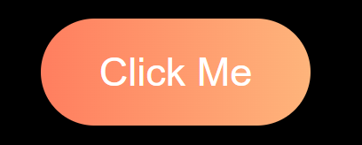
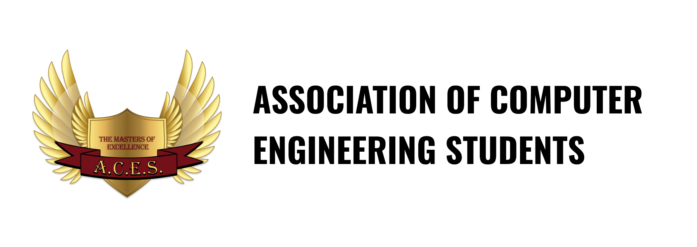

# CSS Buttons Contribution Repository


## How to Contribute
    1. Fork the repository.
    2. Add your custom button code in a new file or modify an existing one.
    3. Submit a pull request with a description of your button style.
    NOTE: ADD HTML AND CSS SEPERATE FILES!!

Let's create a diverse collection of CSS buttons together!

## Example

### 1. Simple Animated Gradient Button
```html
<button class="hover-btn">Hover Me</button>

<style>
        body {
            display: flex;
            justify-content: center;
            align-items: center;
            height: 100vh;
            background: #000000;
        }
        .gradient-btn {
            background: linear-gradient(90deg, #ff7e5f, #feb47b);
            color: white;
            padding: 23px 44px;
            border: none;
            border-radius: 50px;
            cursor: pointer;
            font-size: 30px;
            transition: background 0.5s ease;
        }

        .gradient-btn:hover {
            background: linear-gradient(90deg, #feb47b, #ff7e5f);
        }
</style>
```


\
_A project by Association of Computer Engineering Students, [DIT Pimpri](https://engg.dypvp.edu.in/)_


